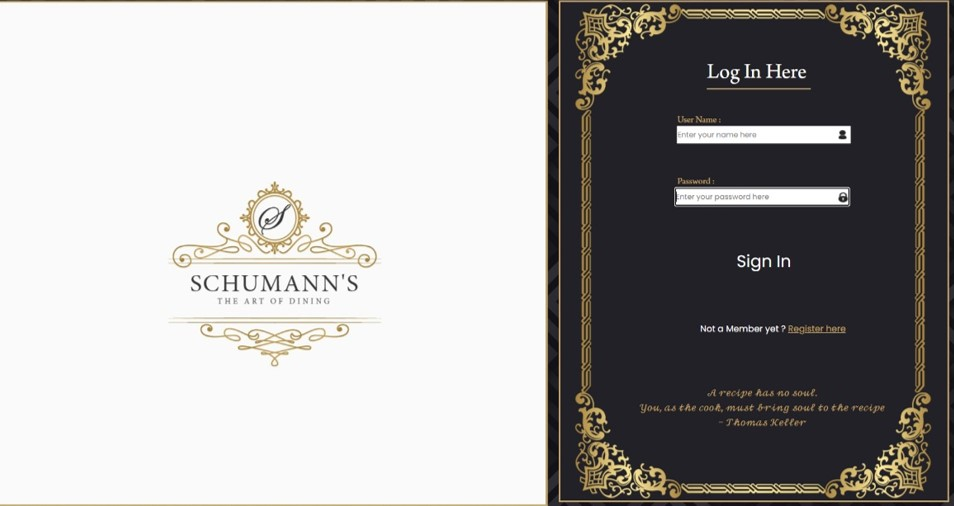
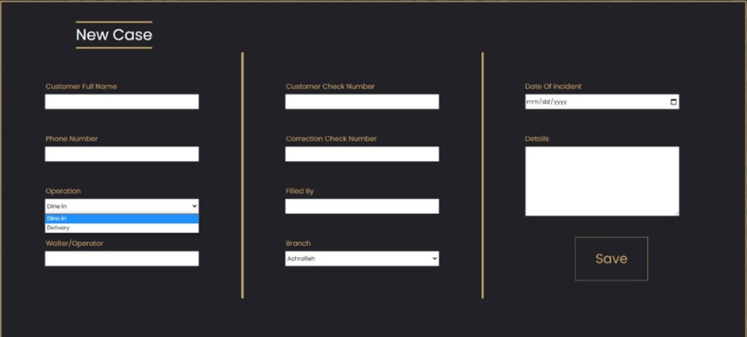

*	Created a modern looking customer relationship management website for a fictitious restaurant company.
*	Connected to a SQL Database, users are allowed to register and log in to the website. Also, it can showcase marketing campaigns. Additionally, authenticated users are able to manage employee information, employee schedule request and incident cases that happened with customers in detail
*	Technologies: C#, HTML5, CSS, JavaScript, Azure SQL Database

